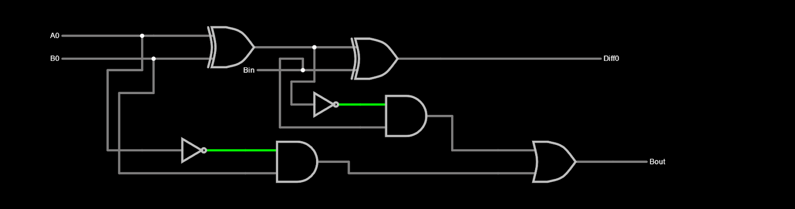
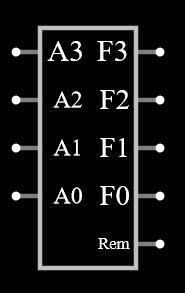

# ALU Logic Gate and HDL Design

A 4-bit arithmetic logic unit (ALU) that performs eight basic operations was designed using [Falstad](https://www.falstad.com/circuit/) as the final project for Basic Circuits I.

These eight basic operations include:

1. $A + B$ with carry in and carry out
2. $A - B$ with borrow in and borrow out
3. $B - A$ with borrow in and borrow out
4. $2 \times A$ with an overflow flag
5. $\frac{A}{2}$ with an overflow flag
6. $A \times B$ with an overflow flag
7. $A \oplus B$
8. $A \lt B$

Negative outputs are not considered.

## Logic Gate Process

### Operation 1: $A + B$

A 4-bit adder was designed with an OR gate, and four full-adders which each consisted of two half-adders.

#### [Half-Adder](https://tinyurl.com/26sxbmyw) and [4-Bit Adder Subcircuit](https://tinyurl.com/2b7qvenk) Design

### Operation 2: $A - B$

A 4-bit subtractor was designed with and OR gate, and four full-subtractors which each consisted of two half-subtractors.

#### Half-Subtractor, Four Full-Subtractors, and [4-Bit Subtractor Subcircuit](https://tinyurl.com/225nt4u7)

### Operation 3: $B - A$

The same design for $A - B$ was used, but with the input nodes switched.

### Operation 4: $2 \times A$

The same design from $A + B$ was used, but with the $B$ input node replaced and wired to $A$.

#### Half-Adder Using One Input

### Operation 5: $\frac{A}{2}$

Unforunately, constructing this operation through logic gates was difficult and time consuming, so a custom logic was used by inputting the following truth table:

| A3  | A2  | A1  | A0  | F3  | F2  | F1  | F0  | Rem |
| :-: | :-: | :-: | :-: | :-: | :-: | :-: | :-: | :-: |
|  0  |  0  |  0  |  0  |  0  |  0  |  0  |  0  |  0  |
|  0  |  0  |  0  |  1  |  0  |  0  |  0  |  0  |  1  |
|  0  |  0  |  1  |  0  |  0  |  0  |  0  |  1  |  0  |
|  0  |  0  |  1  |  1  |  0  |  0  |  0  |  1  |  1  |
|  0  |  1  |  0  |  0  |  0  |  0  |  1  |  0  |  0  |
|  0  |  1  |  0  |  1  |  0  |  0  |  1  |  0  |  1  |
|  0  |  1  |  1  |  0  |  0  |  0  |  1  |  1  |  0  |
|  0  |  1  |  1  |  1  |  0  |  0  |  1  |  1  |  1  |
|  1  |  0  |  0  |  0  |  0  |  1  |  0  |  0  |  0  |
|  1  |  0  |  0  |  1  |  0  |  1  |  0  |  0  |  1  |
|  1  |  0  |  1  |  0  |  0  |  1  |  0  |  1  |  0  |
|  1  |  0  |  1  |  1  |  0  |  1  |  0  |  1  |  1  |
|  1  |  1  |  0  |  0  |  0  |  1  |  1  |  0  |  0  |
|  1  |  1  |  0  |  1  |  0  |  1  |  1  |  0  |  1  |
|  1  |  1  |  1  |  0  |  0  |  1  |  1  |  1  |  0  |
|  1  |  1  |  1  |  1  |  0  |  1  |  1  |  1  |  1  |

This is to be revised in the future.

### Operation 6: $A \times B$

#### Breakdown Illustration

#### [Implementation](https://tinyurl.com/29qgg86j) and [Subcircuit](https://tinyurl.com/27bo2969)

  

### Operation 7: $A \oplus B$

This was simply implemented by using four XOR gates.

#### Implementation and Subcircuit

### Operation 8: $A \lt B$

This was simply implemented using four AND gates with every input of A inverted, so output is true only when $A = 0$ and $B = 1$.

#### Implementation and Subcircuit

### Switch

A 3-bit decoder is designed to act as a switch with its corresponding output connected to the right operator using AND gates.

#### Implementation and Subcircuit

## Full Logic Gate Implementation

## System Verilog

Due to a time crunch, implementing a logic gate-level design was not feasible. A behavioral model was made instead, and attached as a .sv file.
